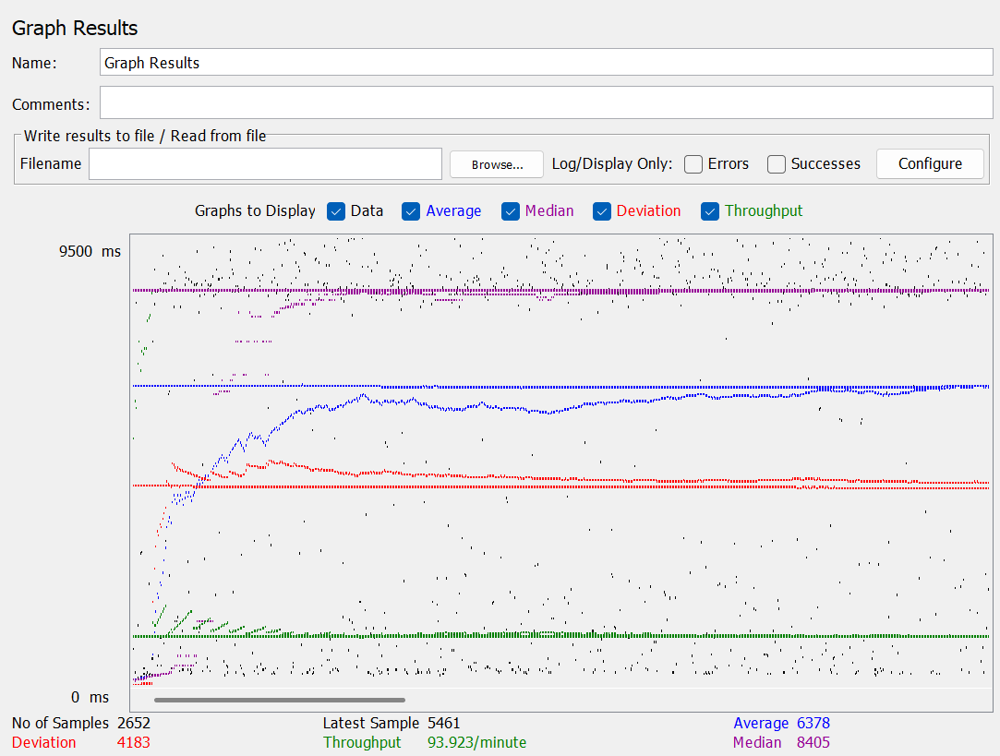
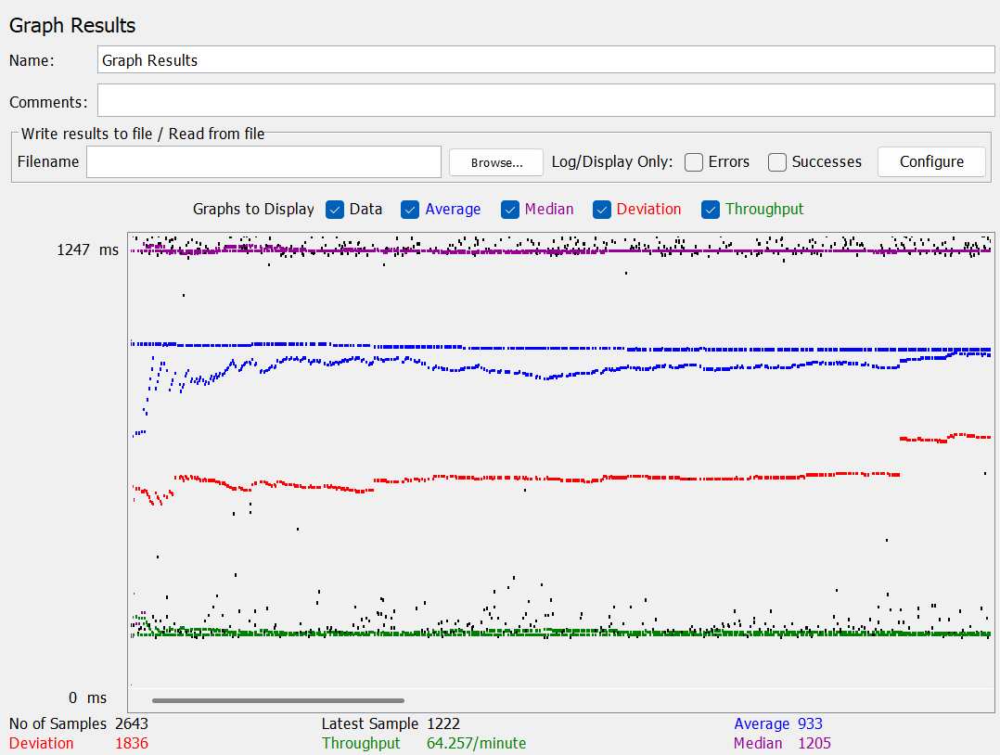
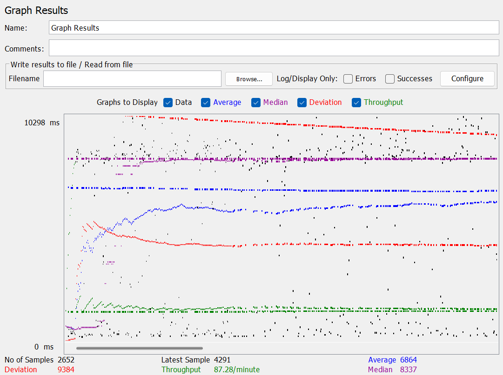
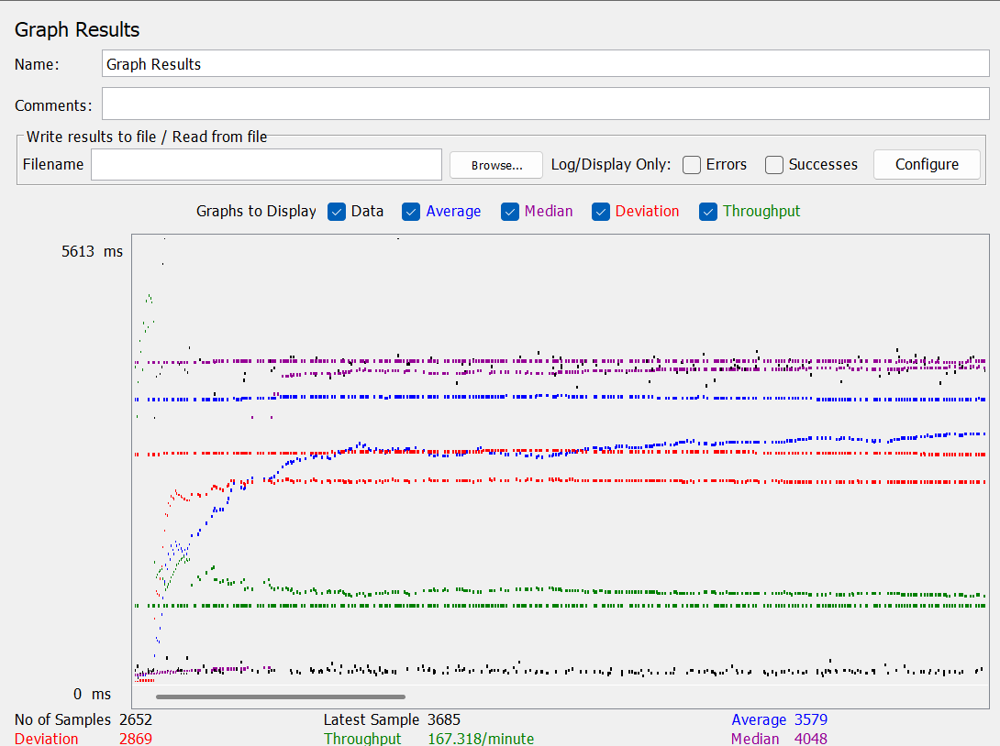
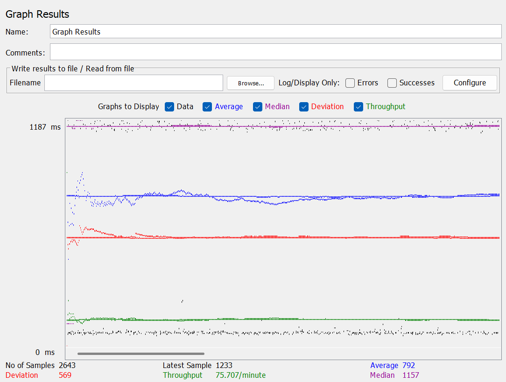
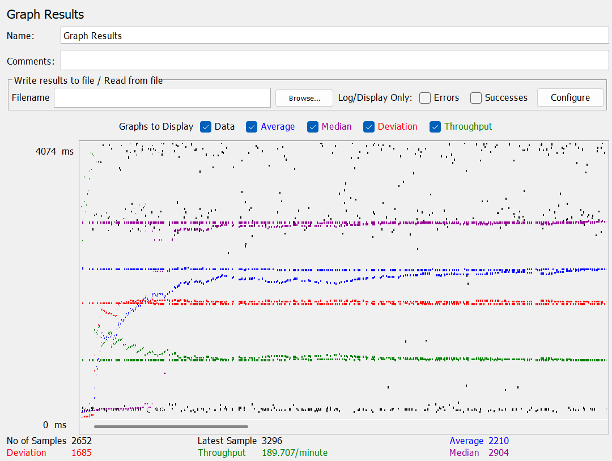

# cs122b-4
> Demonstration: [https://youtu.be/jyqnEpHWISE](https://youtu.be/jyqnEpHWISE)

The fourth project extends the third project and implements autocomplete suggestions, fuzzy search with user defined functions, and scales the application with connection pooling, master-slave replication, and load balancing. Performance tests are also performed with jMeter to measure the performance of the search feature.

## Features

* Autocomplete Suggestions
  * Perform full-text search on movie titles and return top 10 entries
  * Support keyboard navigation and update search bar when suggestion entry is highlighted
  * Jump to corresponding movie page when suggestion entry is clicked
  * Small delay time and minimum character requirement to perform autocomplete search  
  * Cache suggestion lists of each query sent to the backend server
* Fuzzy Search using User-Defined Functions
  * Implement fuzzy search with substring matching and Levenshtein Edit Distance Algorithm (LEDA)
  * Fuzzy search takes the union of the results from ``LIKE`` and ``edth``
  * Normalize edit distance based on query length to tune edit distance
  * Search results combine fuzzy search and full-text search
* Connection Pooling
  * ``WebContent/META-INF/context.xml`` enables connection pooling and caching for prepared statements.
  * ``src/customers/AutocompleteServlet`` and ``src/customers/FullTextSearchServlet`` use prepared statements to perform fuzzy search and full-text search when queries are received from the frontend.
* Master-Slave Replication
  * ``MASTER_LOG_FILE`` and ``MASTER_LOG_POS`` configured on the master instance
  * Asynchronous data replication from the master instance to the slave instance
  * Master instance handles both read and write requests
  * Slave instance handles only read requests
* Load Balancing
  * MySQL and Tomcat cluster with load balancer to distribute traffic between backend instances
  * Enable connection pooling with minimum and maximum number of pooled connections and TTL values
  * Enable sticky sessions to ensure cookies are passed properly
* Performance Tests
  * Measure performance of search feature based on average query time, average search servlet time (TS), and average JDBC time (TJ)
  * Log TS and TJ on servlets and calculate average TS and TJ with log processing script
  
## JMeter Performance Tests Results

| Single Instance Version Cases                   | Graph Results                                                                                                                         | Average Query Time (ms) | Average Search Servlet Time (ns) | Average JDBC Time (ns) |
|-------------------------------------------------|---------------------------------------------------------------------------------------------------------------------------------------|-------------------------|----------------------------------|------------------------|
| Case 1: HTTP/10 threads (No connection pooling) |  | 6378                    | 6222752491.20969                 | 5136559926.728236      |
| Case 2: HTTP/1 thread                           |                            | 933                     | 725666273.5919758                | 722999179.2517033      |
| Case 3: HTTP/10 threads                         |                          | 6354                    | 6170243216.723694                | 6169547199.7906885     |
| Case 4: HTTPS/10 threads                        |                         | 6854                    | 6209355996.607116                | 6208921451.184709      |

| Scaled Version Cases                            | Graph Results                                                                                                                         | Average Query Time (ms) | Average Search Servlet Time (ns) | Average JDBC Time (ns) |
|-------------------------------------------------|---------------------------------------------------------------------------------------------------------------------------------------|-------------------------|----------------------------------|------------------------|
| Case 1: HTTP/10 threads (No connection pooling) |    | 3579                    | 6321559308.036715                | 6321166982.816806      |
| Case 2: HTTP/1 thread                           |                              | 792                     | 701944008.0666162                | 701437536.2668433      |
| Case 3: HTTP/10 threads                         |                            | 2210                    | 5668273961.528966                | 5667704785.655812      |